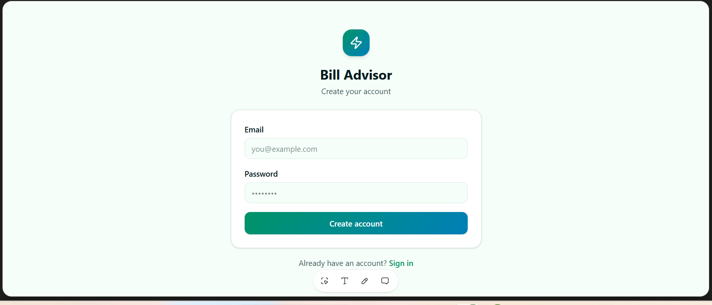
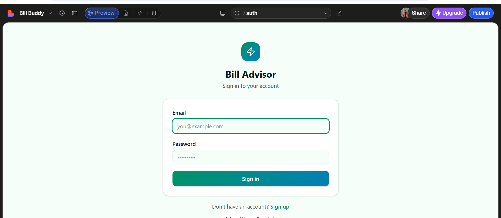
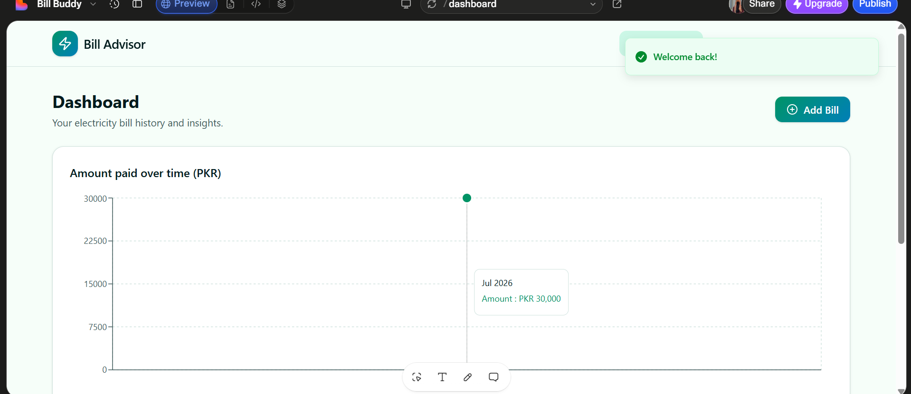
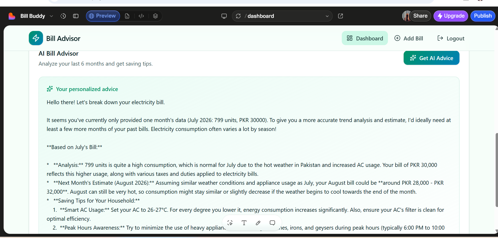

# Bill Advisor — Track & Save on Pakistani Utility Bills

## a. What it does & the problem it solves

**Bill Advisor** is a web app that helps Pakistani households understand and manage their electricity bills. Every month people get confused about why their bill went up or down, and most have no idea how to actually reduce it — there's no simple tool that explains this in plain language.

Bill Advisor lets users log their monthly electricity bills (units consumed + amount paid), visualizes their spending trend over time, and uses AI to explain *why* the bill changed, estimate the next bill, and give practical, low-cost saving tips relevant to Pakistani households.

**Who it's for:** Everyday households in Pakistan who want a clearer, data-driven understanding of their electricity usage and costs — without needing to be an accountant or an engineer to figure it out.

## b. Live URL

🔗 **[https://smart-bill-advisor.lovable.app](https://smart-bill-advisor.lovable.app)**

Anyone can open this link, sign up, and use the app — no invite or access required.

## c. Features

- **Secure signup/login** — email + password authentication (Supabase Auth)
- **Add bill entries** — log month, units consumed, and amount paid (PKR)
- **Edit and delete bills** — full control over your saved entries
- **Dashboard view** — table of all past bills at a glance
- **Trend visualization** — interactive line chart (Recharts) showing spending over time
- **AI-powered advice** — one click ("Get AI Advice") analyzes your last 6 months of bill data
- **Export bills as CSV** — download your bill history for your own records
- **Save advice history** — keep track of past AI recommendations
- **Data privacy** — each user only sees their own bills (Row-Level Security enforced at the database level)

## d. The AI feature

**What it does:** When the user clicks "Get AI Advice," the app sends their last 6 months of bill data (units consumed + amount paid per month) to an AI model. The AI analyzes the trend and returns:
1. A plain-language explanation of why the bill went up or down
2. An estimate of the next month's likely bill (in PKR)
3. 2–3 practical, low-cost saving tips relevant to Pakistani households

This runs entirely server-side (via a TanStack Start server function through the Lovable AI Gateway), so no API key or bill data is ever exposed in the browser.

**System prompt used:**
```
You are a utility bill advisor for Pakistani households. Given the user's 
past electricity bill data (units consumed and amount paid per month), 
analyze the trend and explain in simple, friendly language why the bill 
went up or down, estimate next month's likely bill in PKR, and give 2-3 
practical, low-cost saving tips relevant to Pakistani households (e.g. AC 
usage, peak hours, appliance habits). Keep the response short, clear, and 
in a numbered/bulleted format.
```

**Model used:** Gemini 2.5 Flash, accessed through Lovable's built-in AI Gateway (no separate API key needed — keeps the key off the client entirely).

## e. Tools, services, and AI models used

- **[Lovable](https://lovable.dev)** — AI app builder used to build the full app (frontend, backend, and database wiring) from natural-language prompts
- **Supabase** — authentication and PostgreSQL database (with Row-Level Security so users only see their own data)
- **TanStack Start server functions** — server-side logic, including the AI advice endpoint
- **Lovable AI Gateway (Gemini 2.5 Flash)** — powers the AI advice feature
- **Recharts** — trend line chart visualization
- **GitHub** — version control and public code hosting

## f. Screenshots

**Signup Page**


**Sign In Page**


**Dashboard — Bill Trend Chart**


**AI Bill Advice**


## g. How to run the project

This project was built and is hosted on Lovable, which connects directly to GitHub for version control.

**Option 1 — Use the live app (recommended):**
Simply visit [https://smart-bill-advisor.lovable.app](https://smart-bill-advisor.lovable.app) and sign up.

**Option 2 — Run locally from this repo:**
```bash
# Clone the repository
git clone https://github.com/FizaAslam1/bill-buddy.git
cd bill-buddy

# Install dependencies
npm install

# Set up environment variables
# Create a .env file with your own Supabase project URL and anon key:
# VITE_SUPABASE_URL=your_supabase_url
# VITE_SUPABASE_PUBLISHABLE_KEY=your_supabase_anon_key

# Run the development server
npm run dev
```

> Note: The AI advice feature depends on the Lovable AI Gateway and Supabase project configuration set up in the hosted environment. For full functionality locally, connect your own Supabase project and configure the AI Gateway/API key accordingly.

---

**Author:** Fiza Aslam
**Project:** Final Project — Ship Your AI App
**Submission date:** July 2026
